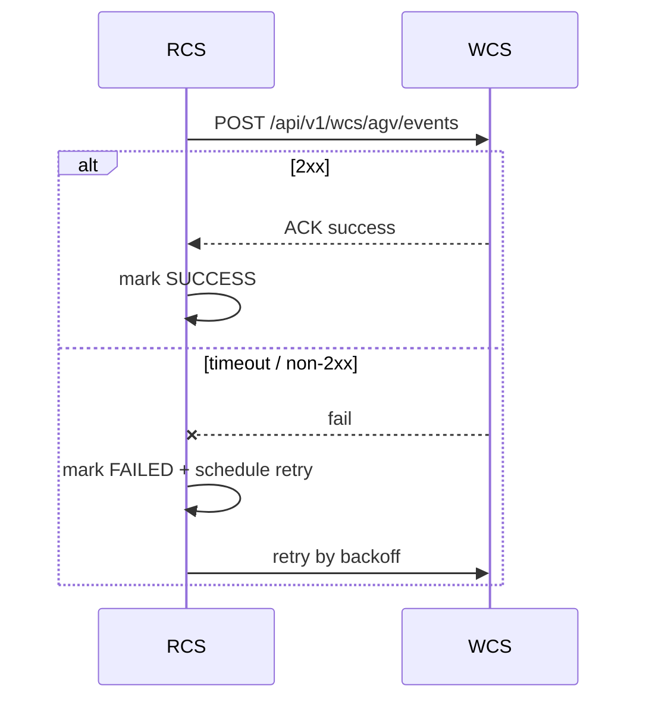

# WCS-RCS HTTP 接口冻结版 V1

- 文档版本：`v1.0.0`
- 冻结日期：`2026-04-15`
- 适用范围：`WCS <-> RCS` HTTP 联调与上线基线
- 变更规则：冻结后仅允许新增可选字段，不允许删除/重命名既有字段

---

## 1. 对接范围

### 1.1 当前已实现接口（代码可用）

| 编号 | 方向 | Method | URL | 说明 |
|---|---|---|---|---|
| I-09 | WCS -> RCS | POST | `/api/v1/wcs/agv/missions` | 创建搬运任务 |
| I-10 | RCS -> WCS | POST | `callback_url` 指定 | AGV 事件回传 |

### 1.2 冻结建议接口（建议同步签字）

| 编号 | 方向 | Method | URL | 说明 | 状态 |
|---|---|---|---|---|---|
| I-09-CANCEL | WCS -> RCS | POST | `/api/v1/wcs/agv/missions/{mission_no}/cancel` | 取消任务 | 规划 |
| I-09-QUERY | WCS -> RCS | GET | `/api/v1/wcs/agv/missions/{mission_no}` | 查询任务状态 | 规划 |
| I-10-BATCH | RCS -> WCS | POST | `/api/v1/wcs/agv/events/batch` | 批量事件回传 | 可选 |

---

## 2. 通用协议约定

### 2.1 请求与响应

- 协议：`HTTP/HTTPS`
- 编码：`UTF-8`
- Content-Type：`application/json`
- 字段命名：规范使用 `snake_case`
- 时间格式：`yyyy-MM-dd HH:mm:ss`，示例 `2026-02-10 10:35:21`

### 2.2 鉴权与签名（RCS -> WCS）

- Bearer：`Authorization: Bearer <token>`（可选）
- 时间戳头：`X-Callback-Timestamp`（毫秒时间戳）
- 签名头：`X-Callback-Signature`
- 签名算法：`HMAC-SHA256`
- 签名串：`timestamp + "." + payload_json`

### 2.3 幂等规则

- I-09：幂等键为 `mission_no`
- I-10：幂等键建议为 `mission_no + event_type + event_time`

### 2.4 追踪字段（建议）

- Header：`X-Trace-Id`
- Header：`X-Request-Id`

---

## 3. I-09 创建搬运任务（WCS -> RCS）

### 3.1 接口定义

- Method：`POST`
- URL：`/api/v1/wcs/agv/missions`

### 3.2 请求字段

| 字段 | 类型 | 必填 | 示例 | 说明 |
|---|---|---|---|---|
| mission_no | string | 是 | M202602100001 | AGV 搬运任务号，RCS 幂等键 |
| task_no | string | 是 | T202602090001 | 对应业务任务号 |
| from_point | string | 是 | P_WAIT_IN_01 | 搬运起点 |
| to_point | string | 是 | ST_IN_01 | 搬运终点 |
| pallet_no | string | 是 | PLT000000123 | 托盘号 |
| priority | int | 否 | 50 | 优先级 |
| callback_url | string | 是 | /api/v1/wcs/agv/events | 回调地址（相对/绝对） |

### 3.3 响应字段（data）

| 字段 | 类型 | 示例 | 说明 |
|---|---|---|---|
| mission_no | string | M202602100001 | AGV 任务号 |
| task_no | string | T202602090001 | 业务任务号 |
| rcs_status | string | RECEIVED | RCS 当前状态 |
| idem_hit | bool | false | 是否命中幂等 |

### 3.4 示例

请求：
```json
{
  "mission_no": "M202602100001",
  "task_no": "T202602090001",
  "from_point": "P_WAIT_IN_01",
  "to_point": "ST_IN_01",
  "pallet_no": "PLT000000123",
  "priority": 50,
  "callback_url": "/api/v1/wcs/agv/events"
}
```

响应：
```json
{
  "code": "0",
  "msg": "OK",
  "data": {
    "mission_no": "M202602100001",
    "task_no": "T202602090001",
    "rcs_status": "RECEIVED",
    "idem_hit": false
  }
}
```

---

## 4. I-10 AGV 事件回传（RCS -> WCS）

### 4.1 接口定义

- Method：`POST`
- URL：由 I-09 的 `callback_url` 指定，建议 `/api/v1/wcs/agv/events`

### 4.2 请求字段

| 字段 | 类型 | 必填 | 示例 | 说明 |
|---|---|---|---|---|
| mission_no | string | 是 | M202602100001 | AGV 搬运任务号 |
| task_no | string | 是 | T202602090001 | 业务任务号 |
| event_type | string | 是 | ARRIVED_FROM | 事件类型 |
| point_id | string | 否 | P_WAIT_IN_01 | 事件发生点位 |
| agv_id | string | 否 | AGV_01 | AGV 编号 |
| battery | int | 否 | 78 | 电量百分比 |
| reason_code | string | 否 | LOW_BATTERY | 失败原因码 |
| reason_msg | string | 否 | battery below threshold | 失败原因描述 |
| event_time | string | 是 | 2026-02-10 10:35:21 | 事件时间 |

### 4.3 event_type 枚举

| event_type | 含义 |
|---|---|
| ARRIVED_FROM | 到达起点 |
| PICKED | 已取货 |
| ARRIVED_TO | 到达终点 |
| DROPPED | 已放货 |
| FAILED | 任务失败 |

### 4.4 响应字段（data）

| 字段 | 类型 | 示例 | 说明 |
|---|---|---|---|
| mission_no | string | M202602100001 | AGV 任务号 |
| task_no | string | T202602090001 | 业务任务号 |
| wcs_status | string | ACCEPTED | WCS 处理状态 |
| idem_hit | bool | false | 是否命中幂等 |

### 4.5 示例

请求：
```json
{
  "mission_no": "M202602100001",
  "task_no": "T202602090001",
  "event_type": "DROPPED",
  "point_id": "ST_IN_01",
  "agv_id": "AGV_01",
  "battery": 74,
  "event_time": "2026-02-10 10:35:21"
}
```

响应：
```json
{
  "code": "0",
  "msg": "OK",
  "data": {
    "mission_no": "M202602100001",
    "task_no": "T202602090001",
    "wcs_status": "ACCEPTED",
    "idem_hit": false
  }
}
```

---

## 5. 任务状态机（WCS 侧消费规则）

### 5.1 推荐状态推进

| 当前状态 | 事件 | 下一状态 | 说明 |
|---|---|---|---|
| CREATED | ARRIVED_FROM | AT_SOURCE | 到达起点 |
| AT_SOURCE | PICKED | LOADED | 已取货 |
| LOADED | ARRIVED_TO | AT_TARGET | 到达终点 |
| AT_TARGET | DROPPED | DONE | 任务完成 |
| 任意非 DONE | FAILED | FAILED | 任务失败 |

### 5.2 乱序处理

- 若收到“回退状态事件”，WCS 应按状态机拒绝回退并记录告警日志。
- `DONE` 后仅允许重复 `DROPPED`（幂等），不允许再进入其他状态。

---

## 6. 错误码映射（FAILED 场景）

| RCS reason_code | WCS 标准码 | 建议动作 |
|---|---|---|
| LOW_BATTERY | AGV_BATTERY_LOW | 挂起任务并触发换车/充电策略 |
| PATH_BLOCKED | AGV_PATH_BLOCKED | 发起路径重算并重试 |
| PICK_TIMEOUT | AGV_PICK_TIMEOUT | 人工复核托盘状态 |
| DROP_TIMEOUT | AGV_DROP_TIMEOUT | 人工复核放货点位 |
| VEHICLE_OFFLINE | AGV_OFFLINE | 切换备车并告警 |
| EMERGENCY_STOP | AGV_ESTOP | 立即中止并提升告警等级 |
| UNKNOWN | AGV_UNKNOWN_ERROR | 进入异常池，等待人工处置 |

---

## 7. 回调重试与时序

### 7.1 成功判定

- WCS 返回 `2xx`：回调成功，不重试
- WCS 返回非 `2xx` 或超时：回调失败，进入重试

### 7.2 建议重试间隔

- 第 1 次：60s
- 第 2 次：120s
- 第 3 次：300s
- 第 4 次：600s
- 第 5 次及以后：1800s

### 7.3 时序图



---

## 8. 统一响应与错误码（冻结建议）

### 8.1 响应结构

```json
{
  "code": "0",
  "msg": "OK",
  "data": {}
}
```

### 8.2 建议错误码

| code | 含义 |
|---|---|
| 0 | 成功 |
| RCS-4001 | 参数校验失败 |
| RCS-4009 | 幂等冲突（同 mission_no 不同请求体） |
| RCS-4010 | 鉴权失败 |
| RCS-4290 | 频率受限 |
| RCS-5000 | 系统内部错误 |

---

## 9. 联调验收清单

1. I-09 正常创建成功，`idem_hit=false`
2. I-09 重复提交同请求体，`idem_hit=true`
3. I-09 重复提交不同请求体，返回幂等冲突
4. I-10 在 `ARRIVED_FROM -> PICKED -> ARRIVED_TO -> DROPPED` 顺序下成功推进
5. I-10 FAILED 可正确触发错误码映射
6. I-10 非 `2xx` 可触发重试并最终成功
7. 签名验签通过与失败路径均验证
8. trace_id 能在 WCS/RCS 双侧日志串联

---

## 10. 实现差异提示（当前样例）

- 当前样例代码 DTO 使用 `camelCase`（如 `missionNo`）。
- 本冻结文档以 `snake_case` 作为联调规范。
- 若不调整序列化策略，联调前需在网关或代码层做字段映射。
